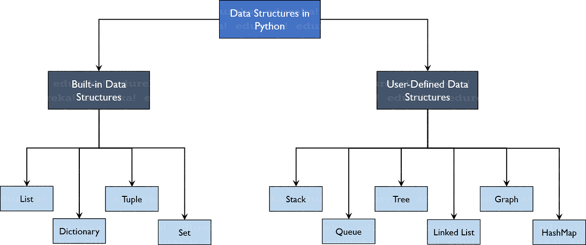

# Python Data Structures
### A. **Built in Data Structures:**
 1. ## **List**
    Stores data of different datatypes in a sequential manner.Mutable in nature. Indexing is used to provide unique address to each element starting from 0 and till end of list called positive indexing and negative indexing (-1) to access elements from last to first.
    ### Declaring a List:
    ```python
          List1 = [] //empty list //[] output
          List2 = ["string",8,9,10,0.234] //["string",8,9,10,0.234]
    ```
    ### Adding elements to list:
      ##### Methods: append(), extend(), insert()
    - append() Adds all the elements passed to it as a single element
    ```python
          list1 = [1,2,3,5]
          list2 = ([5,2])
          list1.append(list2)
          -> [1,2,3,5,[5,2]
    ```
    - extend() Adds all the element one by one into list
    ```python
         list1 = [1,2,3,5]
         list2 = ([5,2])
         list1.extend(list2)
         -> [1,2,3,5,5,2]    
    ```
    - insert() Inserts the element at specified index and increase the size of list too.
    ```python
         list1 = [1,2,3,5]
         list1.insert(2, "sam")
         -> [1,2,"sam",5,5,2]
    ```
    ### Deleting elements from list
    ##### Methods: del(), remove(), pop(), clear()
    - del() deletes the element at given index or can even delete entire list
    ```python
          list1 = [5,8,9,'open','a',78]
          del list1[2]
          -> [5,8,'open','a',78]
          del list1
          print(list1)
          -> error thrown
          del list1[:2] //deleting multiple elements using slicing with del
    ```
    ### Accessing list elements
      - using loop
      ```python
            list1 = [5,8,9,'open','a',78]
            for i in list1:
                print(i)
      ```
      - using slicing
      ```python
           list1 = [5,8,9,'open','a',78]
           print(list1[:2])
           -> [5,8]
           print(list[2:6])
           -> [9,'open','a',78]
      ```
      - using Index
      ```python
           list1 = [5,8,9,'open','a',78]
           print(list1[5])
           -> 78
           print(list1[::-1])
           -> [78,'a','open',9,8,5] // access elements in reverse
      ```
      - other functions used in list:

          len()      # finds length of list

          index()    # find index of element that occurs first

          count()    # find count / occurence of the element

          sorted()   # print sorted list but not change original

          my_list.sort(reverse=True) #sorts original list

          print(my_list)

## 2. **Dictionary**
Used to store key-value pairs. E.g. A phone directory.
A dictionary is a collection which is unordered, changeable and indexed. Dictionary does not allow duplicate keys but values can be duplicated.

### Creating a dictionary
- #### Using curly braces
   ```python
    dict1 = {}
    dict2 = {"name":"priya", "id":2} 
   ```
- #### Using dict()
    ```python
    dict1 = dict()
    dict2 = dict({"name":"priya"})
    ```

- #### Modifying key-value pairs in dictionary
  To change values of dictionary we need to use keys.
  To add an item to dictionary, just add another key-value pair
     ```python
    my_dict = {'First': 'Python', 'Second': 'Java'}
    print(my_dict)
    my_dict['Second'] = 'C++' #changing element
    print(my_dict) # {'First': 'Python', 'Second': 'C++'}
    my_dict['Third'] = 'Ruby' #adding key-value pair
    print(my_dict) # {'First': 'Python', 'Second': 'Java', 'Third': 'Ruby'}
    ```
- #### Deleting Key value pairs
  Methods used: pop(), popitem(), clear()
  
  ##### Using pop():
  To delete the values pop() can be used. It returns the value that has been deleted.
     ```python
    my_dict = {'First': 'Python', 'Second': 'Java', 'Third': 'Ruby'}
    a = my_dict.pop('Third') #pop element
    print('Value:', a) # Ruby
    print('Dictionary:', my_dict) #{'First': 'Python', 'Second': 'Java'}
    ```
  ##### Using popitem():
   To retrieve the deleted key-value pair, we use popitem(). It returns a tuple of key and value.
     ```python
     my_dict = {'First': 'Python', 'Second': 'Java'}
     b = my_dict.popitem() #pop the key-value pair
     print('Key, value pair:', b) # {'Second': 'Java'}
     print('Dictionary', my_dict) # #{'First': 'Python'}
     ```
  ##### Using clear()
  It is used to clear / remove / delete all the elements in a dictionary.
     ```python
      my_dict.clear() #empty dictionary
      print(my_dict) # {}
     ```
- #### Accessing elements
  Elements can be accessed only using keys.
  Methods - get(), using keys
  ```python
  my_dict = {'First': 'Python', 'Second': 'Java'}
  print(my_dict['First']) #access elements using keys; o/p= Python 
  print(my_dict.get('Second')) # Java
  ```
- Other functions used with dictionary

  keys(), values(), items(), fromkeys()
  ```python
  my_dict = {'First': 'Python', 'Second': 'Java', 'Third': 'Ruby'}
  print(my_dict.keys()) #get keys
  # -> dict_keys([‘First’, ‘Second’, ‘Third’])
  
  print(my_dict.values()) #get values
  # -> dict_values([‘Python’, ‘Java’, ‘Ruby’])
  
  print(my_dict.items()) #get key-value pairs
  # -> dict_items([(‘First’, ‘Python’), (‘Second’, ‘Java’), (‘Third’, ‘Ruby’)])

  print(my_dict.get('First'))
  # -> Python
  ```

## 3.  **Tuple**
Collection of objects separated by commas. Ordered, Immutable in nature i.e. post creation they cannot be modified. Tuples allows duplicates. Can be used as dictionary keys.

### Creating a tuple
Done using parenthesis, tuple()
   ```python
     tuple1 = ("tree", "leaf", 5,7,8)

     a = tuple() # empty tuple
     # -> ()
     b = tuple((5,7,9,"left"))
     # -> (5,7,9,"left")
     c = tuple((2,))
     # -> (2,)
   ```
### Appending elements
Using '+' operator to add two tuples
   ```python
    tuple1 = (1,8,0,9)
    tuple2 = (7,8,4)
    tuple1 = tuple1 +tuple2 # add elements 
    # -> (1,8,0,9,7,8,4)
   ```
### Accessing tuple elements
Using slicing, loop, index.
   ```python
   tuple1 = (3,89,20,2)
   n = 0
   for i in tuple1: #using loop
       print(f"Element at index {n} is {i}")
       n+=1
    
   tuple1 [:2] # slicing
    # -> (3,89)

   tuple2 = (6,7,8,96,'rabbit') #index
   print(tuple2[0])
   # -> 6
   print(tuple[4][5]) #[4] = 'rabbit'
   # -> t
   ```
#### Other functions
 count(), index()
   ```python
    my_tuple = (1, 2, 3, ['hindi', 'python'])
    my_tuple.count(2) # 1
    my_tuple.index(['hindi', 'python']) # 3
    my_tuple[3][1] = 'english'
    # -> (1,2,3,['hindi', 'english'])
   ```
